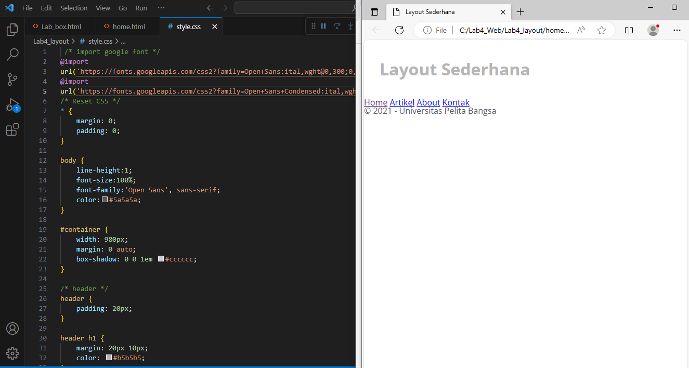

# LANGKAH - LANGKAH PRAKTIKUM 

- Membuat Box Element

- Menambahkan element baru

- Mengubah nya menjadi ke samping kanan

- Membuat layout sederhana

- Menambahkan layout untuk warna kode html

- Menambah layout css untuk warna 

- Menambahkan warna untuk menu

- Mengisi bagian bawah dari menu

- Memberikan background berwarna kode html

- Memberikan background berwarna kode css

- Membuat widget header

- Menambahkan kolom widget text

- Mengubah menjadi ke bawah pada footer bagian bawah

- Menambah gambar bewarna kode html

- Menambah gambar bewarna kode css

- Menambah paragraf baru

Pertanyaan dan Tugas

1. Tambahkan layout pada menu about yang berisi single layout yang berisi deskripsi portofolio 

2. Tambakan layout pada menu kontak yang berisi nama email massage

Jawaban Tugas

1. Pertama tama kita membuat seperti ini

Kemudian kita melanjutkan seperti ini

2. Pertama tama kita membuat seperti ini

Kemudian kita melanjutkan seperti ini

